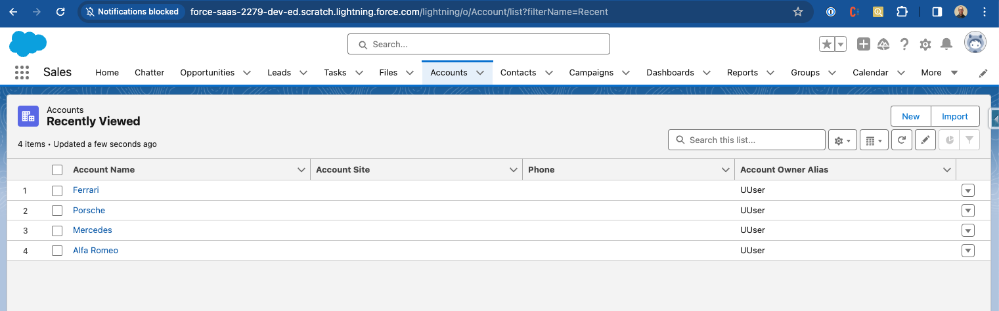
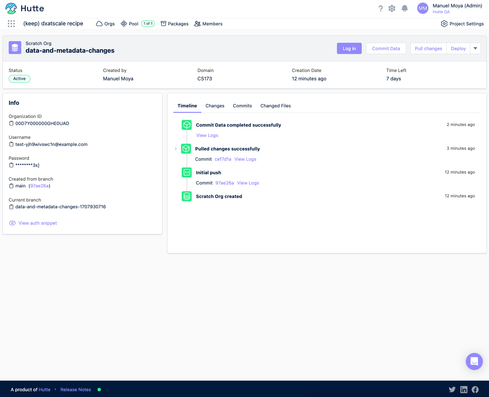
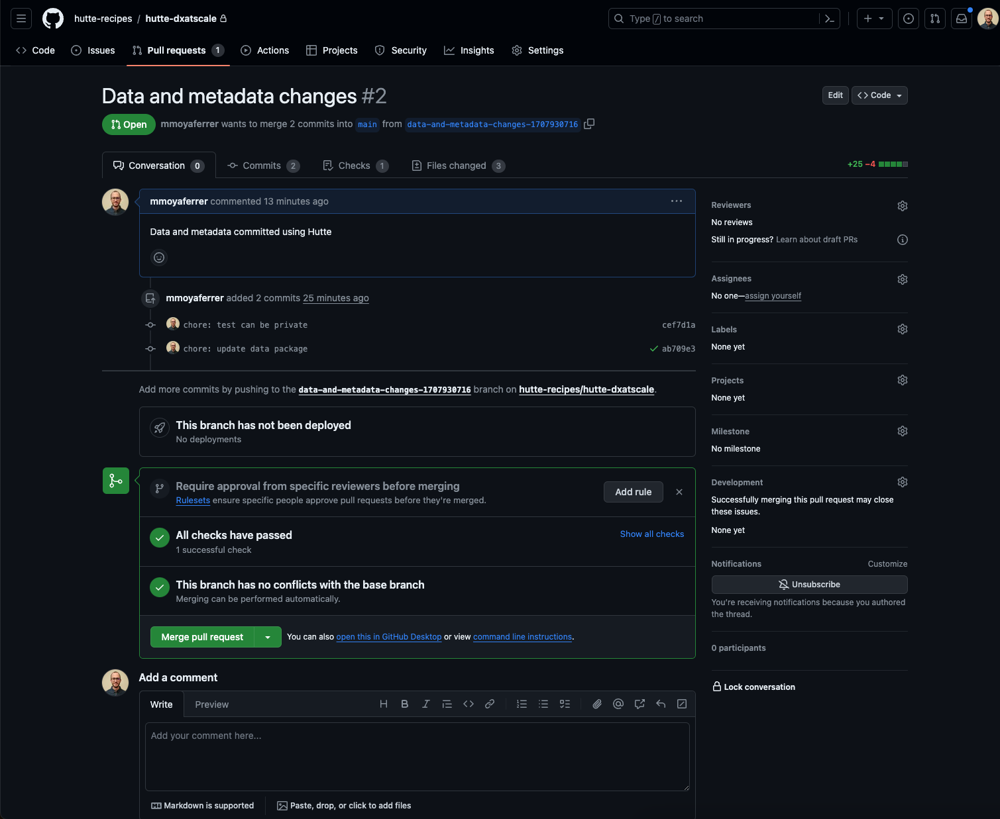
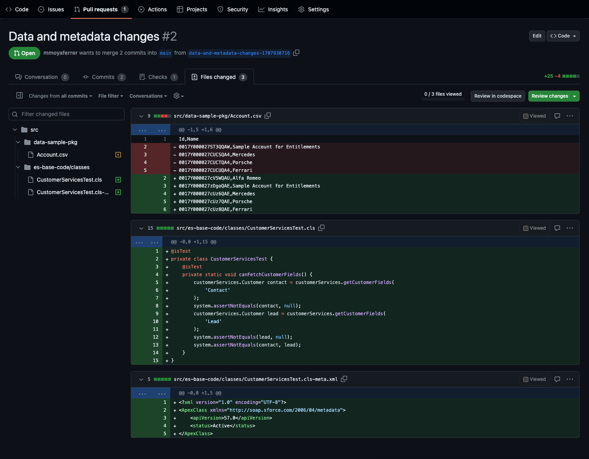
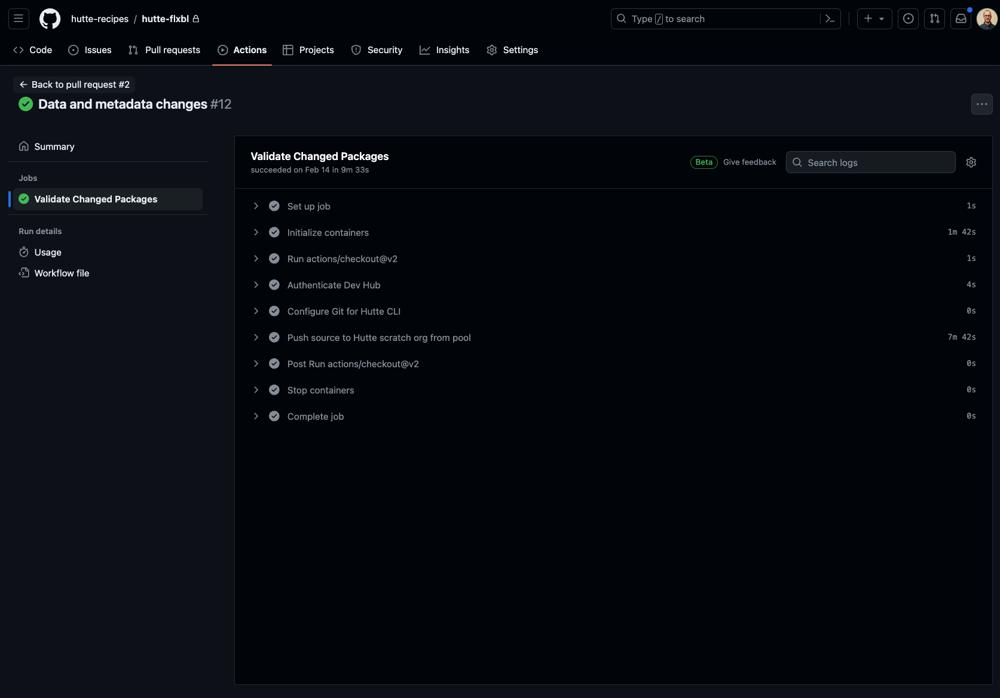
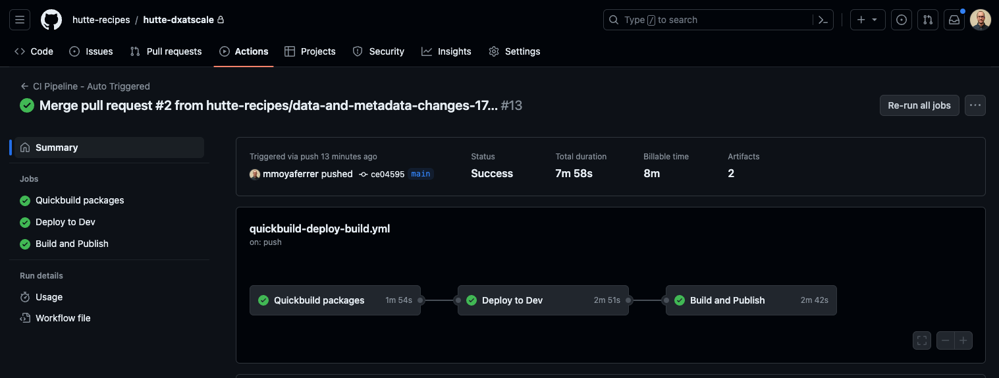
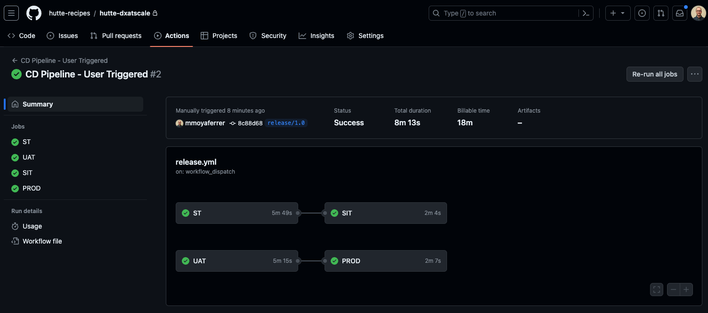

# hutte-flxbl

## Introduction

_Note that Flxbl is the name for DX@Scale (more on [DX@Scale Becomes Flxbl](https://medium.com/flxbl/dx-scale-becomes-flxbl-%CB%88fleks%C9%99b-%C9%99-l-why-a9b12eb0f79b))_

This recipe joins the best of the worlds of Flxbl (formerly DX@Scale) and Hutte. The recipe starts from the [Flxbl template](https://github.com/dxatscale/dxatscale-template) and it has been throughrously adapted to be used in combination with Hutte and therefore incorporating the best functionalities of Hutte platform in the different automations.

To showcase the combination of Hutte and Flxbl the [Easy-Spaces-LWC](https://github.com/trailheadapps/easy-spaces-lwc) application is added to this repository, which follows a modular archictecture.

## Fine-tuning of Hutte and Flxbl

This repository has been adapted accordingly taking into accounts the next facs:

1. Hutte Scratch org/Sandbox creation functionality replaces Flxbl scratch org/sandbox creation
2. Hutte Scratch org/Sandbox Pools replaces Flxbl Pools
3. Github Actions are using Hutte Pool orgs for Pull Request Validations
4. [Hutte.yml](./hutte.yml) is configured to automatically perform packages (metadata and data) provisioning to the created scratch org, besides installing the [sfpowerscripts](https://github.com/dxatscale/sfpowerscripts-artifact) unlocked package.

## Commit Data, not only metadata

A hutte custom button has been created in order to update a Flxbl data package on user-demand

This custom button will:

1. Commit data changes to the git branch
2. When the Pull Request is merged, the triggered Github action will
   1. Create a new Flxbl data package (specified in the [sfdx-project.json](./sfdx-project.json))
   2. Publish it as an Package in the Github Repository
3. When a new scratch/sandbox org is created, the configured script in [Hutte.yml](hutte.yml) will deploy the new data package to the recently created org and therefore having the data seed happening automatically.

### An example by images

1. Let's say that **accounts are created in a Scratch Org**

2. **These account records can be then committed using the `Commit Data` custom button**

3. After that, the **Pull Request validation will actually validate the updated data package**

4. **Finally, when the Pull Request is merged, a new data package will be published. This new data package will be provisioned to any new scratch org**, as configured in [Hutte.yml](./hutte.yml).

## ALM Automations

Pull Request validations, deployments on Pull Request Merge, releases and other operations like these will be performed following the [Flxbl template](https://github.com/dxatscale/dxatscale-template). Some screenshots of these can be seen below.

- **Validations on Pull Request**

- **Build, deploy and packages publish on Merge of Pull Request**

- **Release to Production (and others)**

## Required Github Action Vars/Secrets

### Github Secrets

- HUTTE_API_TOKEN (Can be found in the profile settings of the Hutte user)
- DEVHUB_SFDX_AUTH_URL
- UAT_SFDX_AUTH_URL
- SIT_SFDX_AUTH_URL
- ST_SFDX_AUTH_URL
- DEV_SFDX_AUTH_URL

### Github Vars

- DEV_HUB_ALIAS

## Setup

1. Create a repository from this template using the Github `Use this template` button
2. Set the Github Secrets listed above
3. Create a Hutte project, and link it to the DevHub and the recently created repository
4. At this point, it's ready to be tested with the [Easy-Spaces-LWC](https://github.com/trailheadapps/easy-spaces-lwc) application. You may perform some mock changes and follow the standard development flow to play with it and get a better understanding
5. You may continue next steps by creating an action plan on how to migrate your salesforce application to use this framework combining the power of Hutte and Flxbl

## More on Hutte CLI (Used in Github Actions)

- [Hutte SF Plugin Article](https://docs.hutte.io/en/articles/6836945-hutte-sf-plugin)
- [Hutte SF Plugin Repository](https://github.com/hutte-io/hutte-sf-plugin)

## More on Flxbl

In order to get more information about Flxbl implementation, you may find useful the next links

- [Flxbl docs](https://docs.dxatscale.io/)
- [Flxbl template](https://github.com/dxatscale/dxatscale-template)
- [Flxbl Guide](https://github.com/dxatscale/dxatscale-guide)
- [DX@Scale Becomes Flxbl](https://medium.com/flxbl/dx-scale-becomes-flxbl-%CB%88fleks%C9%99b-%C9%99-l-why-a9b12eb0f79b)
